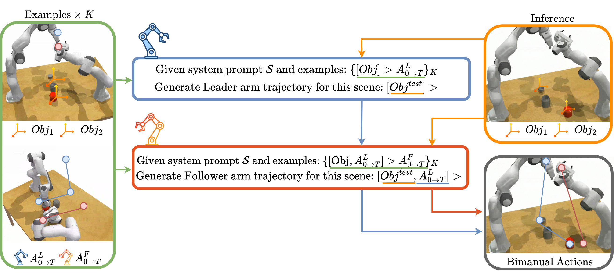

# Bimanual Robot Manipulation via Multi-Agent In-Context Learning

<p align="center">
  <a href="https://arxiv.org/abs/2604.20348"></a>
  <a href="https://huggingface.co/datasets/alesspalma/icl_bimanual_data"></a>
  <a href="LICENSE"></a>
</p>

<p align="center">
  <strong>Alessio Palma, Indro Spinelli, Vignesh Prasad, Luca Scofano,<br>
  Yufeng Jin, Georgia Chalvatzaki, Fabio Galasso</strong>
</p>

<p align="center">
  <a href="https://arxiv.org/abs/2604.20348"><strong>Paper</strong></a> |
  <a href="https://huggingface.co/datasets/alesspalma/icl_bimanual_data"><strong>Dataset</strong></a>
</p>

<p align="center">
  
</p>

This repository contains the official implementation of **BiCICLe** (**Bi**manual
**C**oordinated **I**n-**C**ontext **Le**arning), a training-free framework that
uses standard language models for few-shot bimanual manipulation. BiCICLe casts
bimanual control as a multi-agent leader-follower problem, decomposing each
joint action into sequential, conditioned single-arm predictions. The framework
also supports Arms' Debate refinement and LLM-as-judge Best-of-N selection.
On the TWIN benchmark, BiCICLe achieves up to **71.1% average success rate**,
outperforming the strongest training-free baseline by 6.7 percentage points.

BiCICLe is evaluated on all 13 tasks of the
[TWIN](https://arxiv.org/abs/2407.00278) benchmark and on novel simulation and
real-world tasks. The repository also includes RoboPrompt and KAT baselines,
ablation agents, and a retrieval-augmented VLA baseline based on
[Pi0-FAST](https://github.com/Physical-Intelligence/openpi).

## Contents

- [Quick Start](#quick-start)
- [Installation](#installation)
- [Dataset](#dataset)
- [Agents and Methods](#agents-and-methods)
- [Running LLM/VLM Agents](#running-llmvlm-agents)
- [Running RICL](#running-ricl)
- [Configuration Reference](#configuration-reference)
- [Results and Logs](#results-and-logs)
- [Citation](#citation)

## Quick Start

After completing the installation and downloading the dataset, set `ROOT` in
`form_icl_demonstrations.py` to `<repository>/generated_data/train`, then run:

```bash
conda activate icl_bimanual
export OPENAI_API_KEY="your-api-key"

# Build text ICL demonstrations from the downloaded training split.
python form_icl_demonstrations.py

# Evaluate one task with the base BiCICLe agent.
xvfb-run -a -s "-screen 0 1280x1024x24" python main.py \
    method.name=LeaderFollower \
    model.llm_call_style=openai \
    model.name=gpt-5-mini \
    rlbench.tasks=[bimanual_push_box] \
    rlbench.task_name=bimanual_push_box \
    rlbench.demo_path="$PWD/generated_data/test" \
    framework.logdir="$PWD/logs" \
    framework.eval_episodes=100 \
    rlbench.headless=True
```

---

## Repository Structure

```
icl_bimanual/
├── main.py                         # Evaluation entry point (Hydra)
├── config.yaml                     # Default Hydra config
├── form_icl_demonstrations.py      # Build text ICL prompts for LLM agents
├── form_icl_demonstrations_kat.py  # Build KAT (keypoint) ICL prompts
├── form_icl_demonstrations_ricl.py # Build RICL demo pools (DINOv2-embedded)
├── compute_max_dist_ricl.py        # Recompute max_distance.json from your demo pool
├── test_all_tasks.sh               # Evaluate all LLM/VLM baselines over 13 tasks
├── test_ricl.sh                    # Evaluate RICL over 13 tasks (server + eval loop)
├── agents/
│   ├── ricl_agent.py               # RICL agent (Pi0-FAST + retrieval)
│   ├── roboprompt_agent_bimanual.py
│   ├── roboprompt_agent_oneperarm.py
│   ├── kat_agent_bimanual.py
│   ├── kat_agent_oneperarm.py
│   ├── leader_follower.py
│   ├── adaptive_leader_follower.py
│   ├── sequential_arms.py
│   ├── leader_follower_conversational.py
│   ├── vlm_leader_follower.py
│   ├── arms_debate.py
│   ├── arms_debate_bestofn.py
│   ├── bestofn.py
│   ├── bestofnv2.py
│   └── ...
├── ricl_openpi/                    # Pi0-FAST model + RICL policy server
│   ├── scripts/serve_policy_ricl_bimanual.py
│   ├── src/openpi/policies/policy.py
│   ├── preprocessing/collected_demos/  # RICL demo pools (one dir per task/arm)
│   ├── assets/max_distance.json        # Normalization constant for retrieval distances
│   └── pi0_fast_droid_ricl_checkpoint/ # Model checkpoint (git-lfs)
├── RLBench/                        # Patched RLBench (bimanual action modes)
├── PyRep/                          # CoppeliaSim Python bindings
├── YARR/                           # Training/evaluation runner
└── generated_data/
    ├── train/                      # Training demos (ICL / RICL pools)
    └── test/                       # Test demos (evaluation)
```

---

## Installation

### 1. icl_bimanual conda environment

This environment runs `main.py`, RLBench, PyRep, YARR, and all LLM/VLM/RICL agents.

**1.1 Create the environment**
```bash
conda create -n icl_bimanual python=3.9
conda activate icl_bimanual
pip install pip==24.0      # required by YARR
```

**1.2 CoppeliaSim (required by PyRep)**

Download CoppeliaSim 4.1 for your Ubuntu version from
https://www.coppeliarobotics.com/previousVersions and extract it:
```bash
tar -xf CoppeliaSim_Player_V4_1_0_Ubuntu20_04.tar.xz -C ~/
```

Add to `~/.bashrc` (edit path to match your installation):
```bash
export COPPELIASIM_ROOT=~/CoppeliaSim_Player_V4_1_0_Ubuntu20_04
export LD_LIBRARY_PATH=$LD_LIBRARY_PATH:$COPPELIASIM_ROOT
export QT_QPA_PLATFORM_PLUGIN_PATH=$COPPELIASIM_ROOT
```
Then `source ~/.bashrc`.

**1.3 Install PyRep, RLBench, YARR**
```bash
cd PyRep  && pip install -r requirements.txt && pip install -e . && cd ..
cd RLBench && pip install -r requirements.txt && pip install -e . && cd ..
cd YARR   && pip install -r requirements.txt && pip install -e . && cd ..
```

**1.4 Install project dependencies**
```bash
pip install git+https://github.com/openai/CLIP.git
pip install -r requirements.txt
```

**1.5 Install openpi_client (required for RICL)**
```bash
pip install -e ricl_openpi/packages/openpi-client
```

**1.6 Virtual display (headless / remote servers)**
```bash
sudo apt-get install xvfb
# Use this prefix for all commands that open a display:
xvfb-run -a -s "-screen 0 1280x1024x24" python main.py ...
```

---

### 2. openpi venv (RICL only)

A separate Python environment is required for the Pi0-FAST policy server.
It uses `uv` for reproducible dependency management.

**2.1 Create the venv**
```bash
cd ricl_openpi
pip install uv          # if not already installed
GIT_LFS_SKIP_SMUDGE=1 uv sync
source .venv/bin/activate
uv pip install tensorflow-datasets tensorflow-cpu autofaiss google-genai openai
```

**2.2 RTX 5080 / Compute Capability 12.0 fix (run once after `uv sync`)**

The default lockfile ships `nvidia-cuda-nvcc-cu12==12.6.x`, which is too old for sm_120.
Run this once, then always launch the server with `--no-sync` to preserve the upgrade:
```bash
cd ricl_openpi
uv pip install "nvidia-cuda-nvcc-cu12>=12.8"
```

**2.3 Pull the model checkpoint**
```bash
cd ricl_openpi/pi0_fast_droid_ricl_checkpoint
git lfs pull
```

---

## Dataset

The train and test demonstrations used in the paper are available on
[Hugging Face](https://huggingface.co/datasets/alesspalma/icl_bimanual_data).
Download them into `generated_data/`, which is the default location expected by
the repository scripts:

```bash
pip install -U huggingface_hub
hf download alesspalma/icl_bimanual_data \
    --repo-type dataset \
    --local-dir generated_data
```

The resulting layout should contain:

```text
generated_data/
├── train/   # ICL demonstration pool
└── test/    # evaluation episodes
```

Alternatively, clone the dataset repository with Git LFS:

```bash
git lfs install
git clone https://huggingface.co/datasets/alesspalma/icl_bimanual_data generated_data
```

### Generating Data from Scratch

Data generation uses the RLBench dataset generator. You need **training data**
(used as the ICL/RICL demonstration pool) and **test data** (used for
evaluation).

The paper uses **100 training episodes and 100 test episodes per task**.

```bash
conda activate icl_bimanual
cd RLBench/tools/

# Generate TRAINING data (100 episodes per task)
DISPLAY=:0.0 python dataset_generator.py \
    --tasks=bimanual_push_box \
    --save_path=/path/to/generated_data/train \
    --renderer=opengl \
    --episodes_per_task=100 \
    --processes=1 \
    --variations=1 \
    --all_variations=False
mv /path/to/generated_data/train/bimanual_push_box/variation0 \
   /path/to/generated_data/train/bimanual_push_box/all_variations

# Generate TEST data (100 episodes per task)
DISPLAY=:0.0 python dataset_generator.py \
    --tasks=bimanual_push_box \
    --save_path=/path/to/generated_data/test \
    --renderer=opengl \
    --episodes_per_task=100 \
    --processes=1 \
    --variations=1 \
    --all_variations=False
mv /path/to/generated_data/test/bimanual_push_box/variation0 \
   /path/to/generated_data/test/bimanual_push_box/all_variations
```

Repeat for each of the 13 tasks. After generating data, update the `ROOT` variable
in `form_icl_demonstrations.py` and `form_icl_demonstrations_ricl.py` to point to
your training data directory.

---

## Agents and Methods

| Agent class | Description |
|---|---|
| `RoboPromptAgentBimanual` | LLM predicts joint actions for both arms jointly from textual observations |
| `RoboPromptAgentOnePerArm` | One LLM call per arm; each arm treated independently |
| `KATAgentBimanual` | KAT baseline: DINO keypoint observations instead of object mask positions |
| `KATAgentOnePerArm` | KAT one-per-arm variant |
| `VLMLeaderFollower` | VLM-based leader-follower: right arm leads, left arm follows |
| `LeaderFollower` | Base BiCICLe leader-follower pipeline |
| `AdaptiveLeaderFollower` | Selects the leader arm from the ICL demonstrations once per episode |
| `SequentialArms` | Shared-LLM dimensionality ablation with two sequential 7D arm predictions |
| `ArmsDebate` | BiCICLe + iterative symmetric refinement |
| `BestOfN` | BiCICLe + N candidate sampling with LLM-as-judge selection |
| `BestOfNV2` | Best-of-N leader selection followed by Best-of-N follower selection |
| `ArmsDebateBestOfN` | Combined strategy: ArmsDebate candidates + BestOfN selection |
| `LeaderFollowerConversational` | Conversational refinement ablation (appendix setting) |
| `RICLAgent` | **RICL**: Pi0-FAST VLA with DINOv2-based retrieval augmentation |

---

## Running LLM/VLM Agents

### Prepare ICL demonstrations

**For text-LLM agents (including RoboPrompt baselines)** — builds text-format ICL prompts from training data:
```bash
conda activate icl_bimanual
# Edit ROOT in form_icl_demonstrations.py to point to your train data first
python form_icl_demonstrations.py
```

**For KAT agents** — builds DINO keypoint ICL prompts:
```bash
conda activate icl_bimanual
python form_icl_demonstrations_kat.py
```

### Evaluate all tasks

The convenience script `test_all_tasks.sh` loops over all 13 tasks.
Edit the configuration variables at the top of the script, then run:
```bash
chmod +x test_all_tasks.sh
./test_all_tasks.sh
# Per-task logs: redirections/<llm_call_style>/<agent>/<task>.txt
```

To evaluate a single task manually:
```bash
conda activate icl_bimanual
export OPENAI_API_KEY=your_key    # required for OpenAI models

xvfb-run -a -s "-screen 0 1280x1024x24" python main.py \
    method.name=LeaderFollower \
    model.llm_call_style=openai \
    model.name=gpt-5-mini \
    rlbench.tasks=[bimanual_push_box] \
    rlbench.task_name=bimanual_push_box \
    rlbench.episode_length=25 \
    rlbench.demo_path=/path/to/generated_data/test \
    framework.gpu=0 \
    framework.logdir=/path/to/logs \
    framework.eval_episodes=100 \
    rlbench.headless=True \
    framework.repeat_eval=3
```

For local / HuggingFace models, set `model.llm_call_style=huggingface` and
`model.name=Qwen/Qwen2.5-7B-Instruct` (or any HF-compatible model).

---

## Running RICL

RICL uses two processes per task evaluation:
- **Policy server** (openpi venv) — loads Pi0-FAST once, serves both arms on two websocket ports
- **Evaluation client** (icl_bimanual conda) — runs `main.py` with `RICLAgent`, queries the server

### 1. Prepare RICL demo pools

This script reads training demos from RLBench, extracts images and joint states, computes
DINOv2 embeddings, and saves per-arm demo pools to `ricl_openpi/preprocessing/collected_demos/`.

```bash
source ricl_openpi/.venv/bin/activate

# All 13 tasks, 100 demos each
python form_icl_demonstrations_ricl.py

# Single task
python form_icl_demonstrations_ricl.py --tasks bimanual_push_box --num_episodes 100
```

Output structure:
```
ricl_openpi/preprocessing/collected_demos/
  2026-02-24_bimanual_push_box_right_arm/
    demo_0/processed_demo.npz
    demo_1/processed_demo.npz
    ...
  2026-02-24_bimanual_push_box_left_arm/
    demo_0/processed_demo.npz
    ...
```

Each `processed_demo.npz` contains:

| Key | Shape | Description |
|---|---|---|
| `state` | `(T, 8)` | Joint positions (7) + gripper open (1) |
| `actions` | `(T, 8)` | Joint velocities (7) + gripper open (1) |
| `top_image` | `(T, 224, 224, 3)` | Front camera RGB (uint8) |
| `right_image` | `(T, 224, 224, 3)` | Over-shoulder camera RGB (uint8) |
| `wrist_image` | `(T, 224, 224, 3)` | Wrist camera RGB (uint8) |
| `top_image_embeddings` | `(T, 49152)` | DINOv2 features of the front camera image |

### 2. Calibrate max distance (recommended)

The retrieval distance is normalized by a `max_distance` constant stored in
`ricl_openpi/assets/max_distance.json`. The default was computed over DROID
(real-robot data) and should be recomputed for your RLBench demo pool to ensure
the ICL interpolation weight is properly scaled.

```bash
source ricl_openpi/.venv/bin/activate
cd /path/to/icl_bimanual

# Dry run — inspect pairwise distance statistics without writing anything
python compute_max_dist_ricl.py --dry_run

# Write the 99th-percentile pairwise distance (recommended)
python compute_max_dist_ricl.py --stat p99

# Restrict to specific tasks if your pool spans multiple tasks
python compute_max_dist_ricl.py --tasks bimanual_push_box bimanual_lift_tray
```

### 3. Start the policy server

One server process handles both arms (shared model weights, two websocket ports).
Always use `--no-sync` to prevent `uv` from reverting the nvcc upgrade.

```bash
cd ricl_openpi
uv run --no-sync scripts/serve_policy_ricl_bimanual.py \
    --right_port 8000 \
    --left_port  8001 \
    --config=pi0_fast_droid_ricl \
    --dir=pi0_fast_droid_ricl_checkpoint \
    --right_demos_dir=preprocessing/collected_demos/2026-02-24_bimanual_push_box_right_arm \
    --left_demos_dir=preprocessing/collected_demos/2026-02-24_bimanual_push_box_left_arm \
    --lamda=0.5 \
    --max_demo_frac=0.85
```

Key server arguments:

| Argument | Default | Description |
|---|---|---|
| `--lamda` | (from checkpoint) | ICL weight: `exp(-λ · normalized_dist)`. Lower → more weight on retrieved demo. Typical range for RLBench: `0.3`–`0.8`. |
| `--max_demo_frac` | `0.85` | Fraction of each demo included in the kNN retrieval index. Frames beyond this are excluded to prevent retrieving late-demo retraction/idle phases. |
| `--right_demos_dir` | — | Path to the right-arm demo pool directory |
| `--left_demos_dir` | — | Path to the left-arm demo pool directory |

The server prints diagnostics on every inference step:
```
[RICL] top-1 retrieved: demo=2, step=45/120 (37.5% through demo)
[RICL] raw distances: [0.0, 23.4, 41.7, 59.1, 150.4], max_dist=354.50
distances: [0.0, 0.066, 0.118, 0.167, 0.424]
exp_lamda_distances: [[1.0], [0.936], [0.942], [0.919], [0.808]]
```

### 4. Run evaluation

Once both server ports are accepting connections:

```bash
conda activate icl_bimanual

xvfb-run -a -s "-screen 0 1280x1024x24" python main.py \
    method.name=RICLAgent \
    model.llm_call_style=openai \
    model.name=ricl \
    model.ricl_host=127.0.0.1 \
    model.ricl_right_port=8000 \
    model.ricl_left_port=8001 \
    model.ricl_integration_steps=5 \
    model.ricl_integration_dt=0.05 \
    rlbench.tasks=[bimanual_push_box] \
    rlbench.task_name=bimanual_push_box \
    rlbench.episode_length=250 \
    rlbench.demo_path=/path/to/generated_data/test \
    framework.gpu=0 \
    framework.logdir=/path/to/logs \
    framework.eval_episodes=100 \
    rlbench.headless=True \
    framework.repeat_eval=1
```

Key RICL-specific arguments:

| Argument | Default | Description |
|---|---|---|
| `model.ricl_integration_steps` | `10` | Number of velocity frames to integrate per query. More → larger arm displacement per step. |
| `model.ricl_integration_dt` | `0.1` | Time-step scalar per frame. Total displacement ≈ `steps × dt × velocity_magnitude`. |
| `rlbench.episode_length` | `250` | Use a much longer horizon than LLM agents (25) since RICL queries are far faster. |

**Tuning guidance:**

| Symptom | Recommended fix |
|---|---|
| Arms barely move, task never completes | Increase `integration_steps` (try 10–15) |
| Arms overshoot or are jittery | Decrease `integration_dt` (try 0.02–0.03) |
| ICL is ignored, arms follow model blindly | Decrease `--lamda` (try 0.3–0.5) |
| One arm diverges when almost at goal | Use `--max_demo_frac=0.85` (already default) |
| Retrieved demo looks wrong / out of distribution | Rerun `compute_max_dist_ricl.py` and check retrieval logs |

### 5. Full pipeline: `test_ricl.sh`

Automates server startup, readiness check, evaluation, shutdown, and logging for
all 13 tasks in sequence:

```bash
chmod +x test_ricl.sh

# All 13 tasks
./test_ricl.sh

# Single task
RICL_TASKS="bimanual_push_box" ./test_ricl.sh

# Multiple specific tasks
RICL_TASKS="bimanual_push_box bimanual_lift_tray" ./test_ricl.sh
```

Key configuration variables at the top of the script:

| Variable | Default | Description |
|---|---|---|
| `LAMDA` | `0.5` | ICL interpolation lambda passed to the server |
| `MAX_DEMO_FRAC` | `0.85` | Demo fraction included in the retrieval index |
| `INTEGRATION_STEPS` | `3` | Velocity integration steps per policy query |
| `INTEGRATION_DT` | `0.05` | Velocity integration timestep |
| `EVAL_EPISODES` | `100` | Episodes to evaluate per task |
| `EPISODE_LENGTH` | `250` | Max steps per episode |
| `REPEAT_EVAL` | `1` | Times to repeat evaluation (reports mean ± std if >1) |

Log locations:
- `redirections/ricl/RICLAgent/<task>.txt` — full evaluation output per task
- `/tmp/ricl_bimanual_<task>.log` — policy server output per task

---

## Configuration Reference

All evaluation parameters use [Hydra](https://hydra.cc/) and can be overridden
from the command line. The default config is [config.yaml](config.yaml).

```yaml
method:
    name: LeaderFollower            # agent class name (see Agents table above)

model:
    llm_call_style: openai          # "openai" | "huggingface"
    name: gpt-5-mini               # model name or HuggingFace path
    leader: right                   # leader arm for leader-follower agents

rlbench:
    task_name: bimanual_push_box
    episode_length: 25              # max steps per episode (use 250 for RICL)
    demo_path: /path/to/test/data
    headless: True

framework:
    gpu: 0
    logdir: /path/to/logs
    eval_episodes: 25
    repeat_eval: 1                  # >1 runs multiple seeds and reports mean ± std
    seed: 333
```

---

## Results and Logs

After evaluation, results are saved in two places:

1. **Per-task text logs** — `redirections/<llm_call_style>/<agent>/<task>.txt`
   Full stdout including per-episode outcomes and the final success rate summary.

2. **YARR metric logs** — `logs/<task>/`  
   Structured JSON/CSV metrics accumulated by YARR's `SimpleAccumulator`.

Quick check of final success rate:
```bash
# LLM baselines
tail -5 redirections/openai/RoboPromptAgentOnePerArm/bimanual_push_box.txt

# RICL
tail -5 redirections/ricl/RICLAgent/bimanual_push_box.txt
```

---

## Citation

If you use this code or dataset, please cite:

```bibtex
@misc{palma2026bimanual,
  title         = {Bimanual Robot Manipulation via Multi-Agent In-Context Learning},
  author        = {Palma, Alessio and Spinelli, Indro and Prasad, Vignesh and
                   Scofano, Luca and Jin, Yufeng and Chalvatzaki, Georgia and
                   Galasso, Fabio},
  year          = {2026},
  eprint        = {2604.20348},
  archivePrefix = {arXiv},
  primaryClass  = {cs.RO},
  url           = {https://arxiv.org/abs/2604.20348}
}
```

## License

This project is released under the [MIT License](LICENSE). Vendored components
under `RLBench/`, `PyRep/`, `YARR/`, and `ricl_openpi/` retain their respective
licenses.

---

## Acknowledgements

Built on top of:
- [RLBench](https://github.com/stepjam/RLBench) — robot learning benchmark and simulation environment
- [PerAct / YARR](https://github.com/peract/peract) — evaluation runner infrastructure
- [openpi / Pi0-FAST](https://github.com/Physical-Intelligence/openpi) — VLA model backbone used by RICL
- [DINOv2](https://github.com/facebookresearch/dinov2) — visual embeddings for nearest-neighbour retrieval
